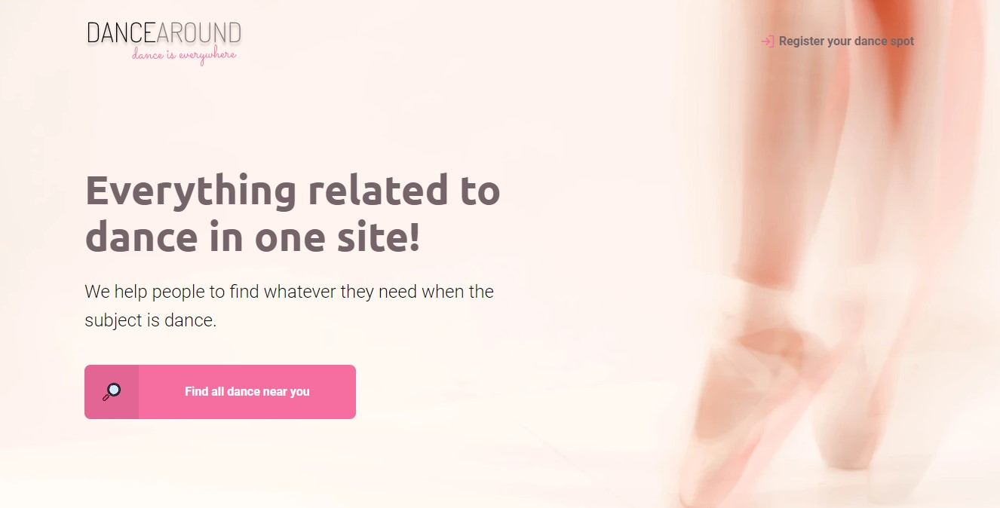
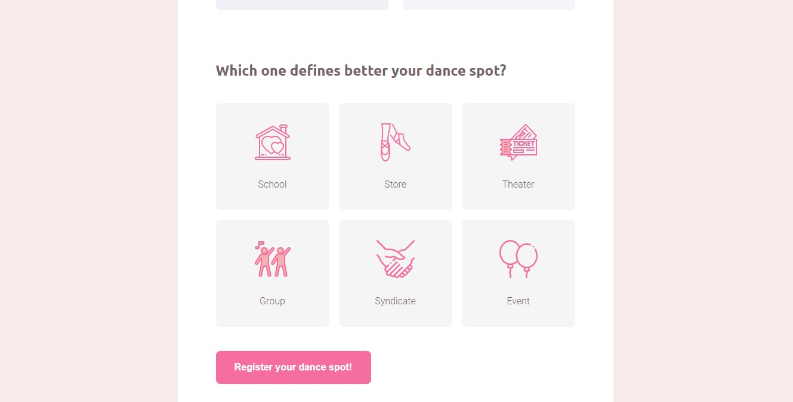

<h1> New Level Week 1 -Rocketseat </h1>
<h2> Dance Around </h2>

 Project developed to follow the instructions given by Mayk Brito (Rocketseat) during the New Level Week.

 It consumes date from API: https://servicodados.ibge.gov.br/api/v1/localidades/estados/{UF}/distritos and https://servicodados.ibge.gov.br/api/v1/localidades/estados/{UF}/municipios 

                                

<h3> Technologies </h3>
<ul>
  <li>HTML</li>
  <li>CSS</li>
  <li>JS</li>
  <li>SQLite3</li>
</ul>

<h3> Functionalities </h3>
<ul>
  <li>Add a dance spot</li>
  <li>Search by city</li>
</ul>

<h3> Result </h3>

<h4><strong>Home</strong></h4>

<h4><strong>Registration Page</strong></h4>

